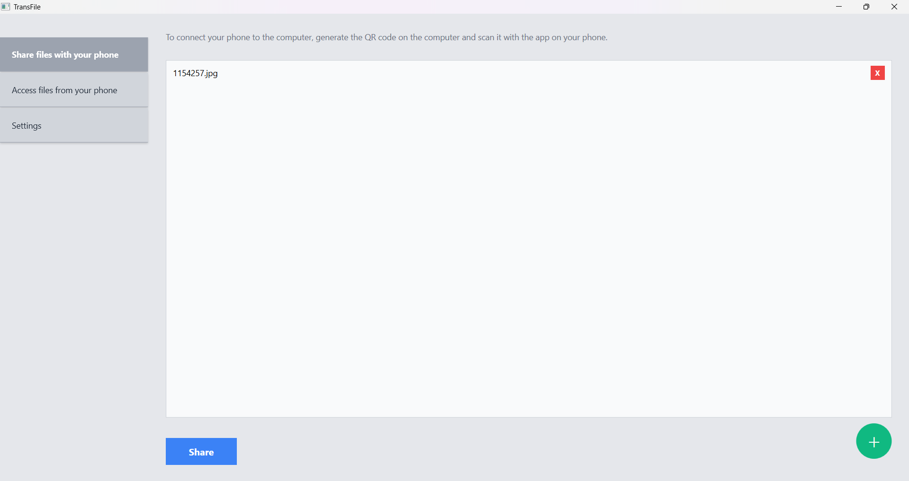
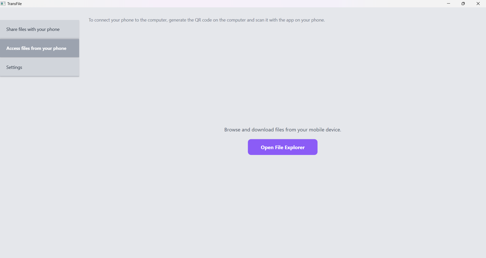
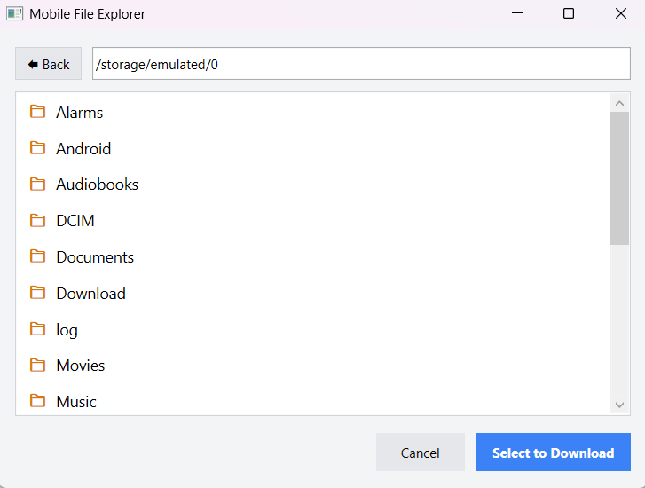
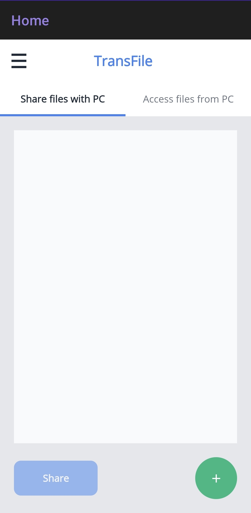
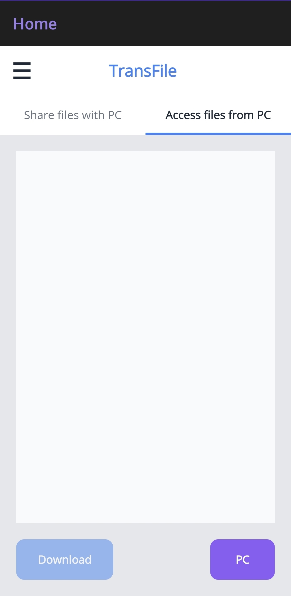
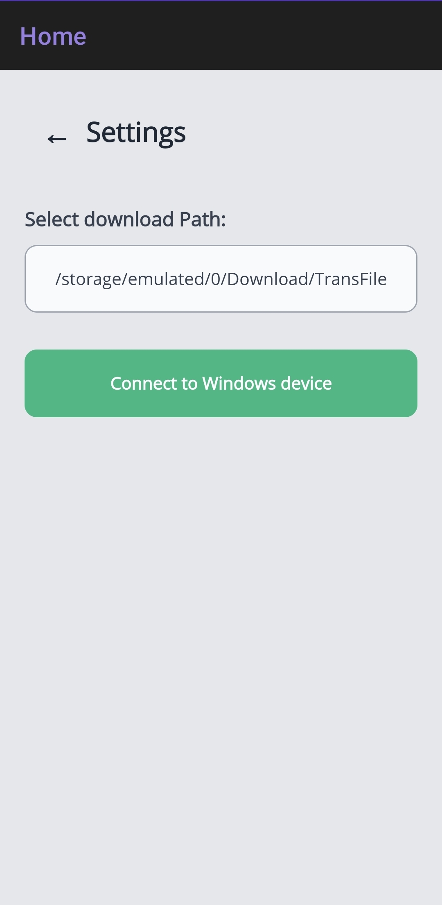

# TransFile 


**TransFile** is a bi-directional, cross-platform software solution designed to natively transfer files between Windows computers and Android devices over a local network (Wi-Fi), without the need for cables or an active internet connection.

This project eliminates the friction of moving files between mobile devices and desktops by utilizing a local peer-to-peer (P2P) approach, instant QR Code pairing, and an integrated remote file explorer.

---

## ✨ Key Features

* **Zero-Config Pairing (QR Code):** The PC dynamically generates a QR Code containing its local IP address. The Android app uses the camera to scan it and establishes an HTTP communication channel in seconds.
* **Bi-directional Transfer:** Send files from PC to Android and vice versa, with support for batch file transfers.
* **Remote File Explorer:** * The PC can browse the Android device's folders (fully supporting the strict *Scoped Storage* restrictions of Android 11+).
  * The Android app can remotely navigate the Windows hard drives and files.
* **100% Offline and Private:** All data transfer happens exclusively over the Local Area Network (LAN). No data ever passes through external servers or the cloud.
* **Instant Native Sync:** Integration with the Android *Media Scanner* to ensure transferred files instantly appear in the native Gallery or File Explorer apps.

---

## 📸 Screenshots


<p float="left">
  
  
  
  
  
  
  
</p>

---

## Architecture and Technologies

The project is split into two applications that simultaneously act as both REST Client and Server:

1. **Windows App (WPF + C#):**
   * User interface built with XAML.
   * Uses `HttpListener` to host a local micro-server that exposes endpoints for *upload*, *download*, and directory browsing (`/list`, `/downloadfile`, etc.).
   * **QRCoder** library to generate pairing QR codes on-the-fly.

2. **Android App (.NET MAUI + C#):**
   * Modern XAML interface with native resizing and animations.
   * **ZXing.Net.Maui** library for optical QR code scanning.
   * Bypasses modern Android *Scoped Storage* policies (`MANAGE_EXTERNAL_STORAGE`) to allow full system folder navigation.
   * Hosts its own background `HttpListener` to serve requested files back to the PC.

---

## ⚙️ Prerequisites and Installation

To compile and run this project locally, you will need:

* [Visual Studio 2022](https://visualstudio.microsoft.com/) (with the **.NET desktop development** and **.NET Multi-platform App UI development** workloads installed).
* .NET 10.0 SDK.
* An Android device (or emulator) and a Windows PC **connected to the same Wi-Fi network**.

* To install dependencies there is a batch file with a script. You can run the following command on the TransFile root directory
  ```bash
  .\install_dependencies.bat
  ```
  
### How to run:
- Clone this repository:
   ```bash
   git clone https://github.com/martimclaudino/TransFile.git
   ```

- Change into the TransFile/Windows directory (you will need to be in admin mode)
   ```bash
   cd TransFile/Windows
   ```

- Run the following command
   ```bash
   dotnet run
   ```

- The Windows App window will open. Go into the *Settings* tab and generate the download QR code with your phone.
   You can also change the directory to which the files will be saved to if you please.

- After downloading the Android App grant the camera access permission (it will ask you automatically).

- Go into the *Settings* tab on the Mobile App and `Connect to Windows Device`. This will open your camera.

- On the *Settings* tab in the Windows App, `Generate qr code`. Scan it with your phone.

- Congrats! You can now easily transfer files between your Android and Windows devices with the intuitive interface.
